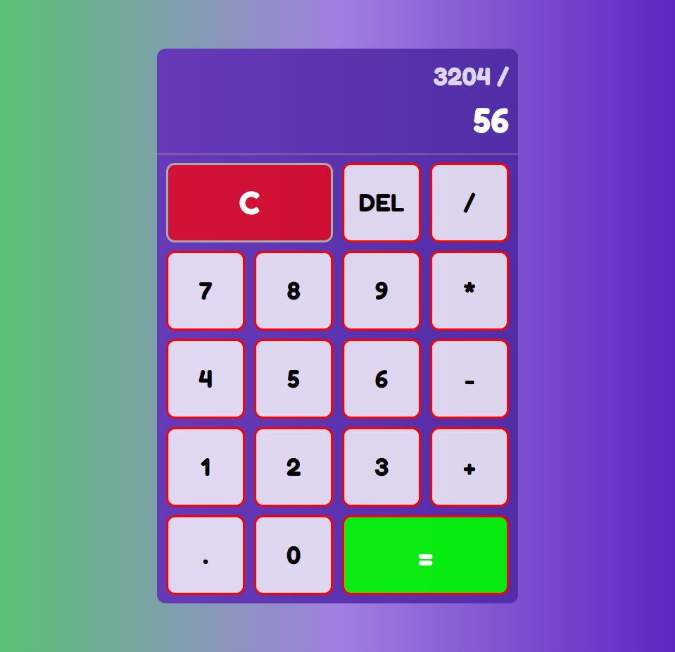

# Vanilla JS Calculator 

This is a simple calculator app that can perform basic arithmetic operations such as addition, subtraction, multiplication, and division.

## Installation

To use this app, simply download or clone the repository to your local machine and open the index.html file in your web browser.

Alternatively, you can also access the live demo of the app [here](https://rm-vanillajs-calculator.netlify.app/)

## Usage

To perform an arithmetic operation, simply click on the corresponding button on the calculator interface. For example, to add two numbers, enter the first number, click the addition button, enter the second number, and click the equal button to get the result. The result will be displayed on the calculator interface.

## Technologies Used

This application was built using:

- HTML
- CSS
- JavaScript

## Contributing

If you'd like to contribute to this project, please follow these steps:

1. Fork the repository
2. Create a new branch (git checkout -b feature/your-feature-name)
3. Commit your changes (git commit -am 'Add some feature')
4. Push to the branch (git push origin feature/your-feature-name)
5. Create a new pull request

## License

This project is licensed under the MIT License - [MIT](https://choosealicense.com/licenses/mit/)